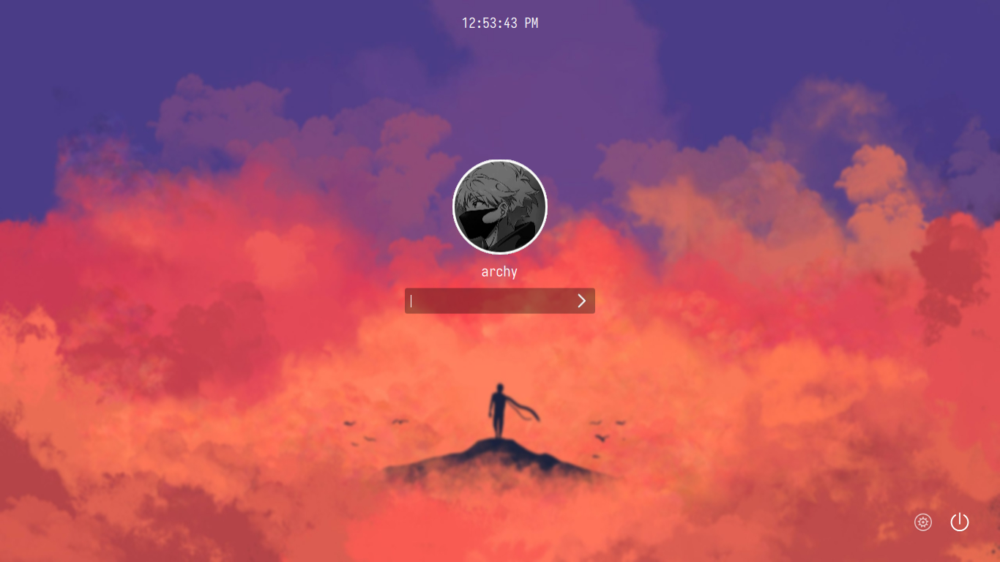
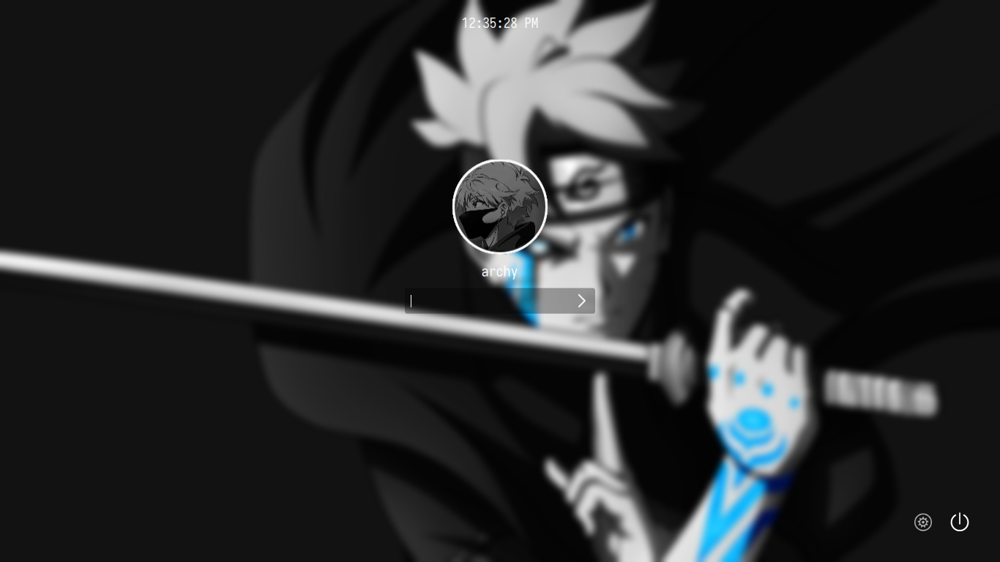
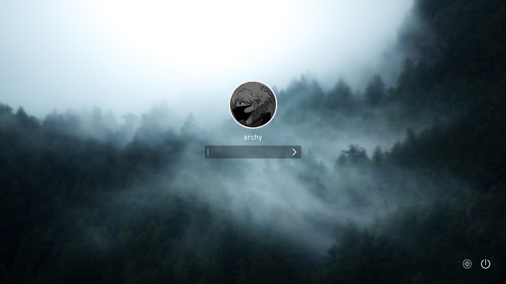

# Anime theme for Sddm

**A simple anime theme for SDDM**

## Preview :

- itachi

- baruto

- forest


#### more preview 

## Installation :

clone the repo and run install.sh with sudo.
```
git clone https://github.com/shinas101/Itachi-sddm-theme.git
cd Itachi-sddm-theme
chmod +x ./install.sh
sudo ./install.sh
	eg : sudo ./install.sh
		Select a Background :
		1) Itachi
		2) Baruto
		3) solo-leveling
		4) jujutsu-kaisen
		5) art-1
		6) art-2
		7) forest
		#? 1
		[*]Theme Installed successfully


```
### how to add avatar :
- Copy your avatar to `/usr/share/sddm/faces/` as \<username\>.face.icon
-   eg: `/usr/share/sddm/faces/jhon.face.icon`
<!---https://github.com/shinas101
