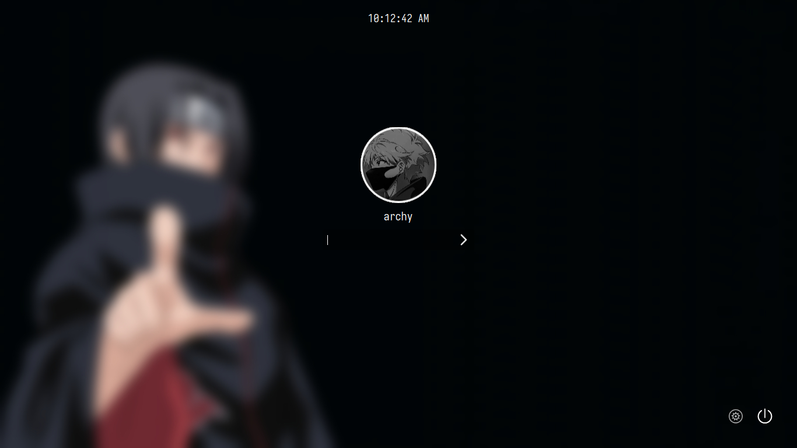

# Itachi theme for Sddm

**A simple anime theme for SDDM**

## Preview :

## Installation
clone the repo and run install.sh with sudo.
```
https://github.com/shinas101/Itachi-sddm-theme.git
cd Itachi-sddm-theme
chmod +x ./install.sh
sudo ./install.sh

```
### how to add avatar
- Copy your avtar to `/usr/share/sddm/faces/` as \<username\>.face.icon
-   eg: `/usr/share/sddm/faces/jhon.face.icon`
<!---https://github.com/shinas101
